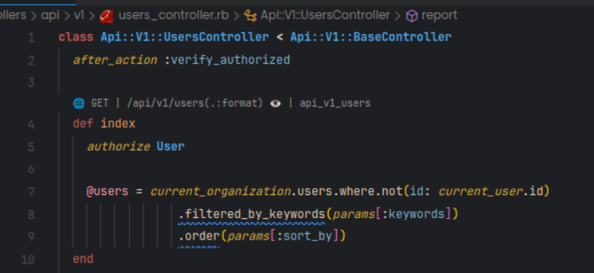

# Rails Route Codelens

## Description

Rails Route Codelens is a Visual Studio Code extension that provides code lenses for Ruby on Rails controller files. It enhances the development workflow by displaying code lenses that allow quick navigation to corresponding view files.

## Features

- Generates code lenses for Ruby on Rails controller files.
- Links code lenses to corresponding view files for quick navigation.

## Screenshots

## Requirements

- Visual Studio Code (version 1.76.0 or higher)
- Ruby on Rails (version 3.0.X or higher)
- make sure 'rails routes' command executes in terminal without errors

## Installation

1. Launch Visual Studio Code.
2. Open the Extensions view by clicking on the square icon in the left sidebar or pressing `Ctrl+Shift+X`.
3. Search for `Rails Route Codelens` and click Install.
4. Restart Visual Studio Code.

## Usage

1. Open a Ruby on Rails controller file.
2. Code lenses will be displayed above each action defined in the controller.
3. Click on a code lens to navigate to the corresponding view file.

## Troubleshooting

1. It is expected to get a warning message when extension is installed for the first time.
2. Make sure `rails routes` command executes in your project thorough vscode without errors.

## Configuration

Rails Route Codelens does not require any additional configuration.

## Known Issues

There are no known issues at the moment. If you encounter any problems or have suggestions for improvement, please create an issue in the `<git@github.com>:anx450z/route-map.git.
