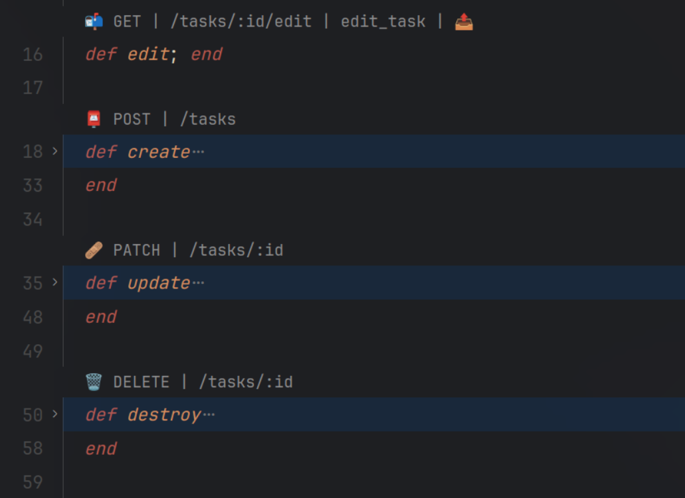
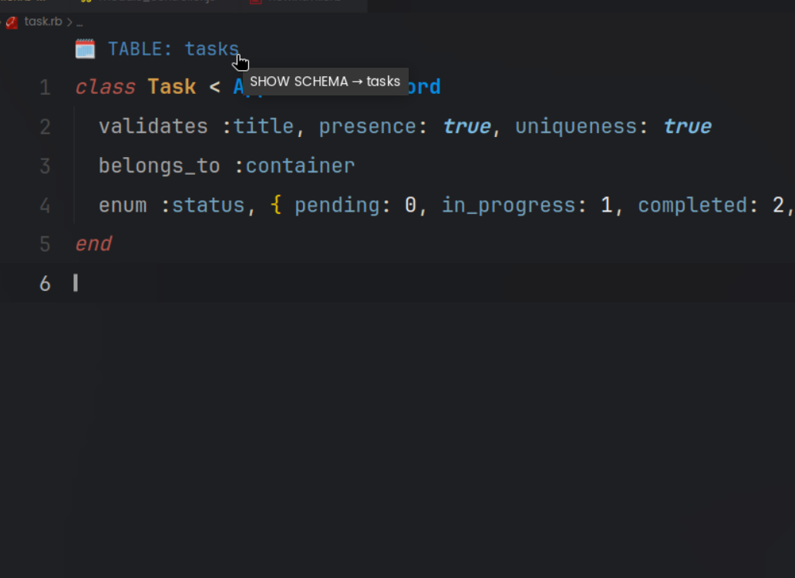
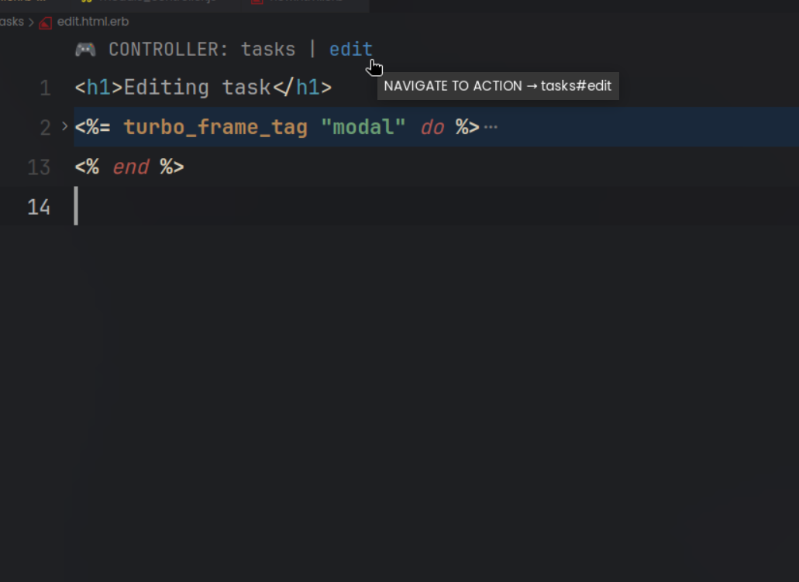
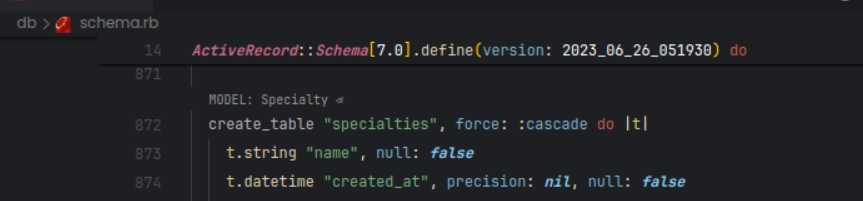

# Rails Route Codelens

## Description

Rails Route Codelens is a Visual Studio Code extension that provides code lenses for Ruby on Rails controller files. It enhances the development workflow by displaying code lenses that allow quick navigation to corresponding view files.

## Features

- Generates code lenses for Ruby on Rails controller files.
- Links code lenses to corresponding view files for quick navigation.

## Screenshots

- Shows the route information above controller actions and link to view files if available.

- Shows the name of the table in models and provide link to navigate to schema file.

- Shows the Controller information above in view files.

- Shows the Model name above table and link to the model file.

## Requirements

- Visual Studio Code (version 1.76.0 or higher)
- Ruby on Rails (version 3.0.X or higher)

## Installation

1. Launch Visual Studio Code.
2. Open the Extensions view by clicking on the square icon in the left sidebar or pressing `Ctrl+Shift+X`.
3. Search for `Rails Route Codelens` and click Install.
4. Restart Visual Studio Code.

## Usage

1. Open a Ruby on Rails controller file.
2. Code lenses will be displayed above each action defined in the controller.
3. Click on a code lens to navigate to the corresponding view file.

## Troubleshooting

1. Make sure `rails routes` command executes in your project thorough vscode without errors.

## Others

- If you like this extension please consider giving a star on github.
- Checkout my Ruby on Rails theme => Ruby theme.
